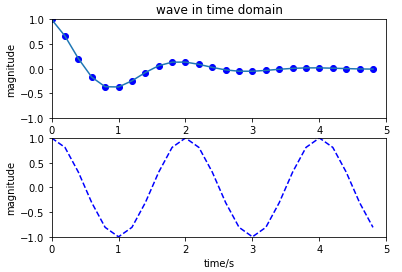
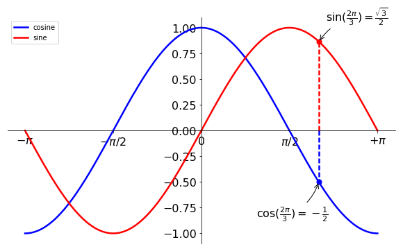

# Matplotlib

### matplotlib.pyplot
Before all:
```python
import matplotlib.pyplot as plt
import numpy as np
```
#### 1. Basic commands
##### plot
```python
# same with matlab
x = np.arange(0, 5, 0.2)
y = np.e**(-x)*np.cos(x*np.pi)

plt.figure(1)

plt.subplot(211)
plt.plot(x, y, 'bo', x, y)
plt.axis([0, 5, -1, 1])
plt.ylabel('magnitude')
plt.title('wave in time domain')

plt.subplot(212)
plt.plot(x, np.cos(x*np.pi), 'b--')
plt.axis([0, 5, -1, 1])
plt.ylabel('magnitude')
plt.xlabel('time/s')
```

<br><br>
Advanced:<br>
from http://www.jianshu.com/p/7fbecf5255f0
```python
X = np.linspace(-np.pi,np.pi,256,endpoint=True)
(C,S)=np.cos(X),np.sin(X)

fig = plt.figure(figsize=(10,6),dpi=80)

ax=plt.gca()

ax.spines['right'].set_color('none')
ax.spines['top'].set_color('none')

ax.xaxis.set_ticks_position('bottom')
ax.spines['bottom'].set_position(('data',0))
ax.yaxis.set_ticks_position('left')
ax.spines['left'].set_position(('data',0))

plt.plot(X, C, 'b-',lw=2.5, label='cosine')
plt.plot(X, S, 'r-',lw=2.5, label='sine')
# line label
plt.legend(loc='upper left')

# set axis range
plt.xlim(X.min()*1.1, X.max()*1.1)
plt.ylim(C.min()*1.1, C.max()*1.1)

# set x-axis
plt.xticks([-np.pi, -np.pi/2, 0, np.pi/2, np.pi],
           [r'$-\pi$', r'$-\pi/2$',  r'$0$', r'$\pi/2$',r'$+\pi$'])

t=2*np.pi/3

plt.plot([t,t],[0,np.cos(t)], color ='blue', linewidth=2.5, linestyle="--")
plt.scatter([t,],[np.cos(t),], 50, color ='blue') #画出需要标注的点

plt.annotate(r'$\sin(\frac{2\pi}{3})=\frac{\sqrt{3}}{2}$',
            xy=(t, np.sin(t)), xycoords='data',
            xytext=(+10, +30), textcoords='offset points', fontsize=16,
            arrowprops=dict(arrowstyle="->", connectionstyle="arc3,rad=.2"))
           #给这个点添加注释，下同

plt.plot([t,t],[0,np.sin(t)], color ='red', linewidth=2.5, linestyle="--")
plt.scatter([t,],[np.sin(t),], 50, color ='red')

plt.annotate(r'$\cos(\frac{2\pi}{3})=-\frac{1}{2}$',
            xy=(t, np.cos(t)), xycoords='data',
            xytext=(-90, -50), textcoords='offset points', fontsize=16,
            arrowprops=dict(arrowstyle="->", connectionstyle="arc3,rad=.2"))

for label in ax.get_xticklabels() + ax.get_yticklabels():
    label.set_fontsize(16)
    label.set_bbox(dict(facecolor='w',edgecolor='None',alpha=0.4))
```

