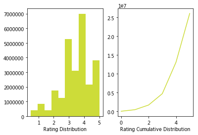

# Recommendation

基于 movielens 数据集，进行 基于内容推荐，协同过滤，矩阵分解的时间

[TOC]

## 1. 数据分析

本项目使用 MovieLens 数据库，其中包含 `ratings.csv`，`movies.csv`，以及 `links.csv` 等文件，项目中主要用到 `ratings,csv` 和 `movies.csv`。

加载需要的库
```python
import pandas as pd
import numpy as np
import matplotlib.pyplot as plt
% matplotlib inline
```

读取 `ratings.csv`
```python
path = "/home/kesci/input/MovieLens/ml-latest/ratings.csv"
df=pd.read_csv(path)
df.head()
```
输出为

. |userId|movieId|rating|timestamp
--|--|--|--|--
0|1|110|1.0|1425941529
1|1|147|4.5|1425942435
2|1|858|5.0|1425941523
3|1|1221|5.0|1425941546
4|1|1246|5.0|1425941556


读取 `genome-scores.csv`
```python
genome_scores=pd.read_csv("/home/kesci/input/MovieLens/ml-latest/genome-scores.csv")
genome_scores.head()
```
输出为
. |movieId|tagId|relevance
  ---|---|---|---
  0|1|1|0.02475
  1|1|2|0.02475
  2|1|3|0.04900
  3|1|4|0.07750
  4|1|5|0.12450

读取 `links.csv`
```python
links=pd.read_csv("/home/kesci/input/MovieLens/ml-latest/links.csv")
links.head()
```
输出为
. |movieId|imdbId|tmdbId
  --|--|--|--
  0|1|114709|862.0
  1|2|113497|8844.0
  2|3|113228|15602.0
  3|4|114885|31357.0
  4|5|113041|11862.0

读取 `tags.csv`
输出为
. |userId|movieId|tag|timestamp
  --|--|--|--|--
  0|1|318|narrated|1425942391
  1|20|4306|Dreamworks|1459855607
  2|20|89302|England|1400778834
  3|20|89302|espionage|1400778836
  4|20|89302|jazz|1400778841


读取 `genome-tags.csv`
输出为
. |tagId|tag
  --|--|--
  0|1|007
  1|2|007 (series)
  2|3|18th century
  3|4|1920s
  4|5|1930s

读取 `movies.csv`
输出为
. | movieId|title|genres
  --|--|--|--
  0|1|Toy Story (1995)|Adventure Animation Children Comedy Fantasy
  1|2|Jumanji (1995)|Adventure Children Fantasy
  2|3|Grumpier Old Men (1995)|Comedy Romance
  3|4|Waiting to Exhale (1995)|Comedy Drama Romance
  4|5|Father of the Bride Part II (1995)|Comedy

分析数据，计算ratings表中用户与电影数
```python
n_items=df.movieId.unique().shape[0]
print (str(n_users) + ' users')
print (str(n_items) + ' movies')
```
输出为
```
270896 users
45115 movies
```

粗略了解数据
```python
df[['rating', 'timestamp']].describe()
```
输出为
 . |rating|timestamp
    --|--|--
    count|2.602429e+07|2.602429e+07
    mean|3.528090e+00|1.171258e+09
    std|1.065443e+00|2.052889e+08
    min|5.000000e-01|7.896520e+08
    25%|3.000000e+00|9.907545e+08
    50%|3.500000e+00|1.151716e+09
    75%|4.000000e+00|1.357578e+09
    max|5.000000e+00|1.501830e+09

计算评分小于1的数量
```python
num1=df[df.rating<1].shape[0]
num2=df[df.rating<2].shape[0]
num3=df[df.rating<3].shape[0]
num4=df[df.rating<4].shape[0]
num5=df.shape[0]
print("评分小于1的记录数为："+str(num1))
```
输出为
```
评分小于1的记录数为：404897
```
可见大多数评分分布在3到4分之间，符合实际情况。

画出评论分布直方图和累计分布折线图

可见大多数评分分布在3到4分之间，符合实际情况。


## 2. Utility Matrix

通过用户对物品的评价信息，我们可以获得一个效用矩阵 $R(N*M)$ 。
$$
\left\{
\begin{matrix}
 r_{00}  & r_{01} & r_{02} & ...\\
 r_{10}  & r_{11} & r_{12} & ...\\
 ...
\end{matrix}
\right\}
$$
其中 $r_{ij}$ 表示用户 $i$ 对物品 $j$ 的评价。
## 3. Content Based

### Item Profile

每个item都有一个 profile，profile 是一个特征的集合。
#### 如何提取特征 (TF.IDF算法）

$$w_{ij} = TF_{ij} * IDF_{i}$$
其中
$$TF_{ij} = \frac{f_{ij}}{max_k \ f_{kj}}$$
词频 $f_{ij}$，即 $term_{i}$, 在 $doc_{j}$ 中的出现频率。
$$IDF_{i} = log \frac{M}{m_{i}}$$
$m_{i}$ 表示出现 $term_{i}$ 的 $doc$ 的数量，$M$ 表示 $doc$ 的数量。

### User profile

现在每个 item 都有一个 profile，用一个向量表示 $\vec{s}$ 。然后需要获得每用户的 profile，用向量 $\vec{c}$ 表示。

$$ \vec{c_{i}} = \sum_{i=1}^{N} w_{j}*\vec{s_{j}}$$
其中 $w_{i}$ 表示每个 item 的权重
$$w_{j} = \sum_{i=1}^{N} w_{ij}$$

在这里，我们可以利用效用矩阵求出一件物品的权重
$$ w_{j} = \sum_{i=1}^{N} r_{ij} $$
其中 $N$ 表示用户数。

### 预测

用户 $i$ 对物品 $j$ 的评价预测可以用其他用户对物品 $j$ 的评价关于他们同用户 $i$ 的相关性加群平均获得。

$$
r_{pred\ ij} = \frac{\sum_{k=1}^{N} r_{kj}*sim(\vec{c_k}, \vec{c_i})}{\sum_{k=1}^{N} sim(\vec{c_k}, \vec{c_i})}
$$

### 结果
```
Content-based MSE: 0.890806407322
```
效果很不错

## 4. Collaborative Filter
协同过滤推荐算法是诞生最早，并且较为著名的推荐算法。主要的功能是预测和推荐。算法通过对用户历史行为数据的挖掘发现用户的偏好，基于不同的偏好对用户进行群组划分并推荐品味相似的商品。协同过滤推荐算法分为两类，分别是基于用户的协同过滤算法（user-based collaboratIve filtering），和基于物品的协同过滤算法（item-based collaborative filtering）。简单的说就是：人以类聚，物以群分。
以用户为基础（User-based）的协同过滤的出发点是与用户兴趣爱好相同的另一组用户，就是计算两个用户的相似度。以物品为基础 (Item-based) 的协同过滤则是通过计算项目之间的相似性来代替用户之间的相似性。

### 基于用户的推荐

主要思想：推荐物品 $d_{i}$ 给 $C$，如果 $C$ 与集合 $D$ 中的其他用户相近，且 $d_{i}$ 获得了 $D$ 中用户的高评价。<br>
它与上面基于内容的推荐算法类似，只是用户的 profile 不再是由物品 profile 加权获得，而是一个 $m$ 维向量，$m$ 为物品数，每一维度为二值。

#### 预测

集合 $D$ 是 $K$ 个与用户 $i$ 相似的且评价过物品 $j$ 的用户。用户 $i$ 对物品 $j$ 的评价 $r_{ij}$ 是 $D$ 中其他用户对物品 $j$ 的评价关于他们同用户 $i$ 之间相似度的加权平均。同时为了平衡用户之间评分倾向不同，可以在用户的评价上加上一个偏置

$$r_{ij} = \hat{r_i} + \frac{ \sum_{k\ in\ D} sim(i,k) * (r_{kj} - \hat{r_k})}{ \sum_{k\ in\ D} sim(i,k)} $$

其中 $\hat{r_k}$ 表示用户 $k$ 对所有商品的评价的均值。

实际操作上可以利用效用矩阵 $R$

$$S_u = R*R'$$

其中 $S_{u\ ij}$ 表示用户 $i$ 与用户 $j$ 的相似度。

### 基于物品的推荐

主要思想：推荐物品 $d_{i}$ 给 $C$，如果 $d_i$ 与集合 $D$ 中的其他物品相近，且 $D$ 中其他物品获得了 $C$ 的高评价。<br>
为了解决大量用户造成基于用户的推荐算法复杂度过高，基于物品的推荐将用户间的相似性替换为物品间的相似性，并推荐相似物品。他与基于用户的推荐类似，只是用到的相似度为物品间的相似度，可以理解为关于物品与用户的契合度为物品匹配合适的用户。
在实际操作中，只需要将效用矩阵 $R$ 转置并进行同上相同的步骤即可。

### 结果
```
User-based CF MSE: 10.2694965683
Item-based CF MSE: 13.7370355988
```
增加top-k
```
Top-k User-based CF MSE: 8.51643832279
Top-k Item-based CF MSE: 10.5646157272
```
选取k为[5,15,30,50,100,200]，分别计算其MSE，并画图：

可见基于商品时，K=15的效果最好；基于用户时，K在30到50之间的效果最好。
由于每个用户对商品的评分严格程度不一，因此每个评分需要减去每位用户评分的均值。增加偏置之后的结果：
```
Bias-subtracted User-based CF MSE: 10.3951114064
Bias-subtracted Item-based CF MSE: 11.6966283117
```

综上所述：对于我们现在所使用的小数据集来说，TOP-K对两种预测的改善效果都比较好；添加偏置对基于商品的预测模型有改善效果，对基于用户的预测模型改善效果不明显。

## 5. Matrix Factorization

对于效用矩阵 $R$ 可以分解为
$$ R \approx P*Q’ = \hat{R}$$
其中 $P$ 为 $N*k$ 维矩阵，$Q$ 为 $M*k$ 维矩阵。
在这里可以理解为，所有物品包含有 $k$ 个特征，$P$ 和 $Q$ 分别表示用户和物品在 k 维特征空间中的坐标，用户对物品的评价即两个向量（用户 和 物品）的距离。

### 矩阵分解

在实际中可以用梯度下降让 $\hat{R}$ 逼近 $R$，设定特征空间维度为K，其中残差可以用 $e_{ij}^{2}$ 表示
$$
e_{ij}^{2} = (r_{ij} - \hat r_{ij})^2 = (r_{ij} - \sum_{k=1}^{K} p_{ik}q_{kj})^2
$$

残差关于 $p_{ik}$ 与 $q_{kj}$ 的偏导为
$$
\frac{\partial \ e_{ij}^2}{\partial p_{ik}} = -2e_{ij}q_{kj} \\
\frac{\partial \ e_{ij}^2}{\partial q_{kj}} = -2e_{ij}p_{ik}
$$

设定学习率为 $\alpha$，则
$$
p_{ik}^{n+1} = p_{ik}^{n} + 2\alpha e_{ij}^nq_{kj}^n \\
q_{kj}^{n+1} = q_{kj}^{n} + 2\alpha e_{ij}^np_{ik}^n
$$

在 `sklearn.decomposition.NMF`中，针对非负矩阵，给了另外一种残差 $E$ 的定义
$$
E = 0.5 * ||X - PQ||_{Fro}^2 + \\
alpha * l_{1\ ratio} * ||\vec P||_1 + \\
alpha * l_{1\ ratio} * ||\vec Q||_1 + \\
0.5 * alpha * (1 - l_{1\ ratio}) * ||P||_{Fro}^2 + \\
0.5 * alpha * (1 - l_{1\ ratio}) * ||H||_{Fro}^2
$$
其中
$$
||A||_{Fro}^2 = \sum_{i,j} A_{ij}^2\\ ||\vec{A}||_1 = \sum_{i,j} abs(A_{ij})
$$

### 结果

由于ratings都非负，因此采用sklearn中的NMF函数计算, 设定 k=2 得左矩阵：
```
[[ 0.04153283  0.        ]
 [ 0.17578624  0.14525541]
 [ 0.02213319  0.25235164]
 ..., 
 [ 0.06611909  0.05766472]
 [ 0.08901085  0.13601614]
 [ 0.17624141  0.5450815 ]]
```
右矩阵：
```
[[  2.68471336e-01   1.18797893e+00   6.40657303e-01 ...,   9.75017876e-03
    3.25005959e-03   4.90886431e-04]
 [  2.98544644e-01   8.50510621e-02   2.62260922e-01 ...,   1.09679685e-02
    3.65598950e-03   2.79626569e-04]]
```
最终预测结果：
```
[[  1.11503751e-02   4.93401304e-02   2.66083126e-02 ...,   4.04952544e-04
    1.34984181e-04   2.03879041e-05]
 [  9.05587914e-02   2.21184475e-01   1.50713556e-01 ...,   3.30710403e-03
    1.10236801e-03   1.26908352e-04]
...
 [  6.45037520e-02   1.17311333e-01   9.26971700e-02 ...,   2.35969245e-03
    7.86564149e-04   8.17279456e-05]
 [  2.10046928e-01   2.55730843e-01   2.55863923e-01 ...,   7.69682196e-03
    2.56560732e-03   2.38933786e-04]]
```
计算误差：
```
NMF-based MSE: 11.5378396642
```
<!--NMF-based MSE: 11.5378396642-->

